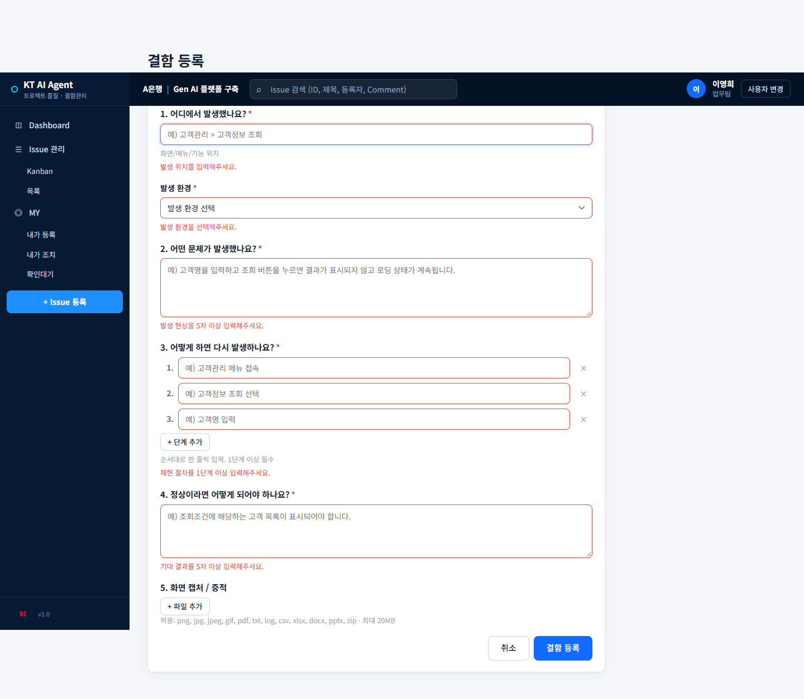
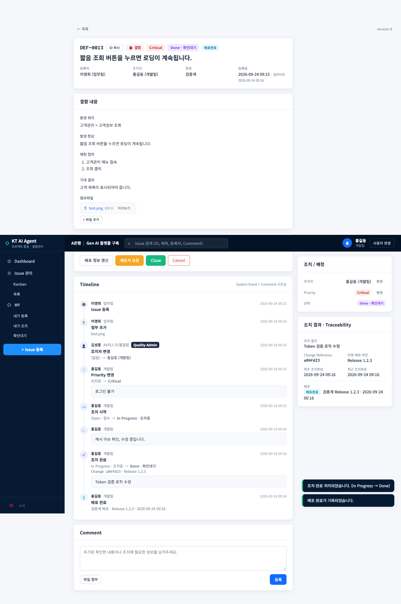
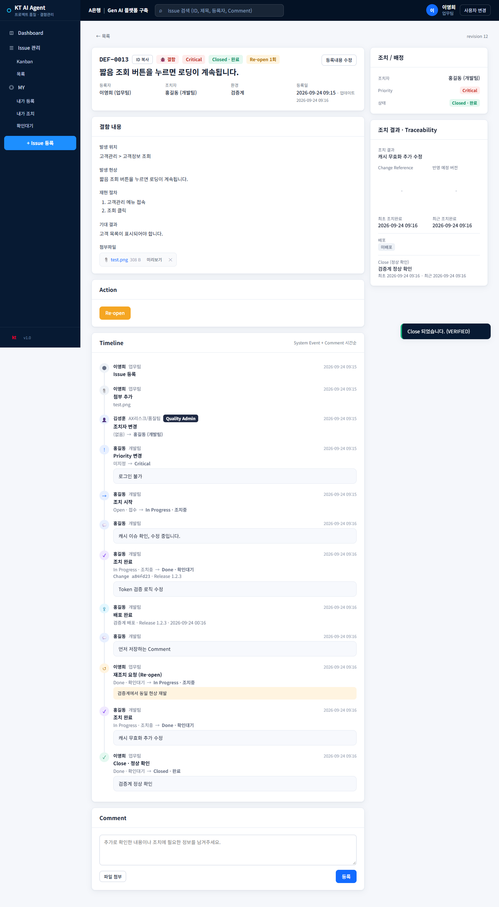
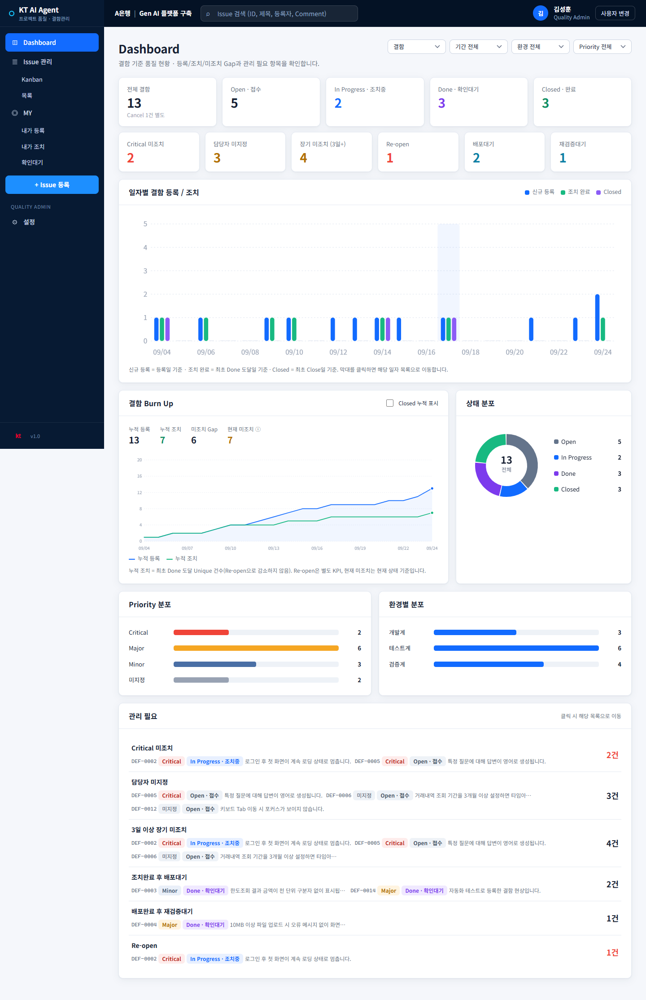
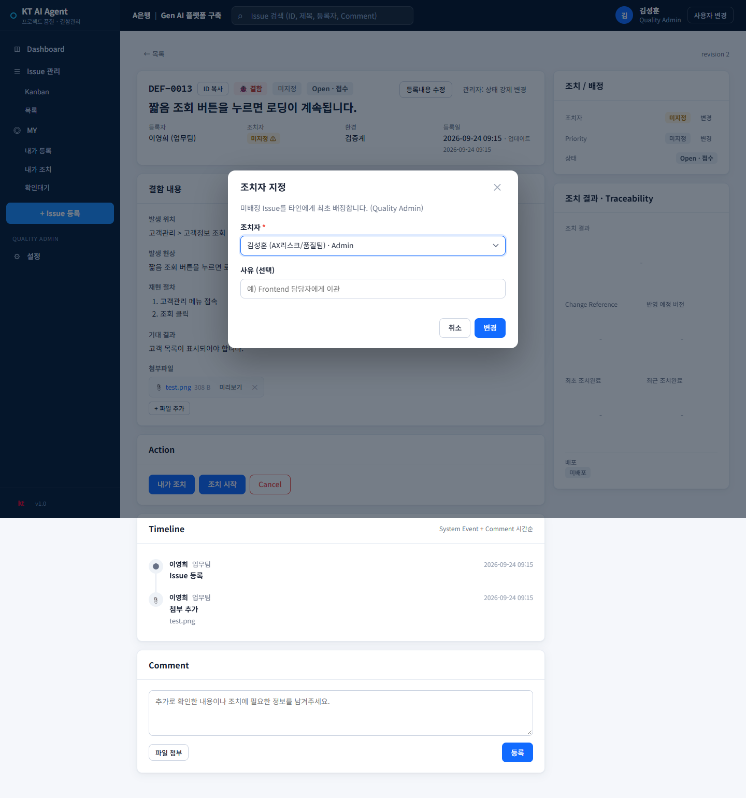
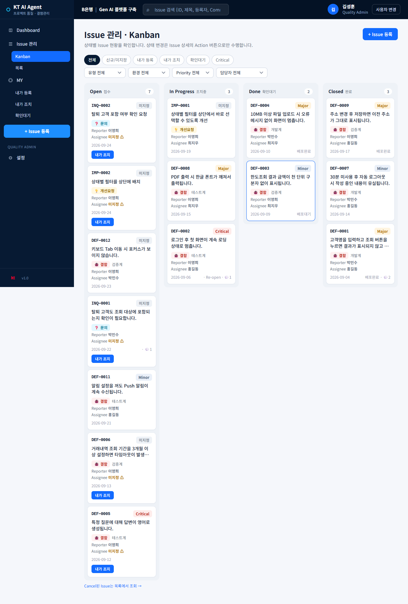
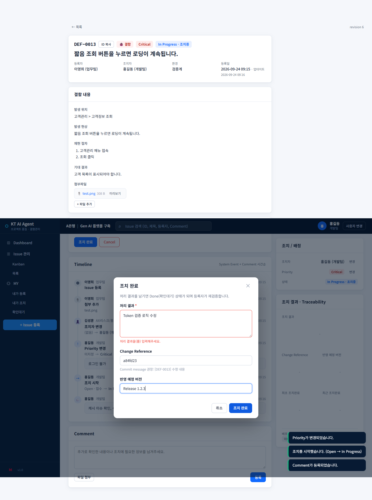

# 도움말

이 문서는 결함관리서비스를 사용하는 구성원을 위한 안내서입니다. 화면의 메뉴명은 현재 서비스 기준이며, 프로젝트 설정에 따라 일부 표시명이 달라질 수 있습니다.

> 최근 기능 업데이트: 사용자 역할(일반 사용자/조치자) 구분, 목록·MY·확인대기 화면의 Issue 미리보기 패널, 로그인 알림 팝업, 외부 시스템 연동 API, Kanban 드래그앤드롭 상태 변경이 추가되었습니다.

## 1. 결함관리 프로세스

```text
Issue 등록
   ↓
담당자 지정 또는 담당자 인수
   ↓
우선순위 지정 · 조치 시작
   ↓
조치 완료(Done)
   ↓
배포 완료
   ↓
검증 또는 종료 합의
   ↓
종료(Closed)
```

### 상태별 의미

| 상태 | 의미 | 다음 단계 |
|---|---|---|
| Open · 접수 | Issue가 등록되었지만 조치가 시작되지 않은 상태 | 담당자 지정, 담당자 인수 |
| In Progress · 조치중 | 담당자가 원인을 확인하고 수정 중인 상태 | 조치 완료 또는 재오픈 |
| Done · 확인대기 | 조치가 완료되어 등록자 또는 업무 담당자의 확인을 기다리는 상태 | 배포, 검증, 종료 |
| Closed · 완료 | 검증 또는 합의가 끝난 최종 상태 | 필요 시 재오픈 |
| Cancel | 중복, 오등록 등으로 처리하지 않기로 한 상태 | 별도 조치 없음 |

### 역할

가입 시 계정 자체에 지정하는 역할(일반 사용자/조치자/Quality Admin)과, 개별 Issue에서 그때그때 정해지는 역할(등록자/조치자)은 서로 다른 개념입니다.

**계정 역할** — 가입 시 선택하고 Quality Admin이 나중에 변경할 수 있습니다.

- 일반 사용자: 결함·개선요청·문의를 등록하고 처리 결과를 확인하는 역할입니다. 본인이 등록한 Issue만 조회할 수 있습니다.
- 조치자: 위 권한에 더해 Issue를 인수하고 조치할 수 있는 역할입니다. 전체 Issue를 조회할 수 있습니다.
- Quality Admin: 사용자·환경·Priority를 관리하고, 필요한 경우 Issue를 재배정하거나 상태를 조정합니다. 항상 전체 Issue를 조회할 수 있습니다.

**Issue별 역할** — 계정 역할과 별개로, Issue 한 건마다 정해집니다.

- 등록자(Reporter): 그 Issue를 등록한 사람. 내용을 보완하고 조치 결과를 확인합니다.
- 조치자(Assignee): 그 Issue를 인수해 원인 분석, 수정, 조치 결과 및 배포 정보를 기록하는 사람. 계정 역할이 "조치자"인 사람만 Issue를 인수할 수 있습니다.

예를 들어 계정 역할이 "조치자"인 사람도 본인이 등록한 Issue에서는 등록자이고, 다른 사람이 등록해 본인이 인수한 Issue에서는 조치자입니다.

## 2. 사용자 가이드

### 2.1 시작하기

1. 서비스에 접속합니다.
2. 기존 사용자라면 사번으로 시작합니다.
3. 처음 사용하는 경우 사번, 이름, 소속팀을 등록하고 역할을 선택합니다.
4. Dashboard에서 현재 결함 현황과 관리 필요 항목을 확인합니다.

가입 시 선택하는 역할은 두 가지입니다.

- 결함 등록/확인만 합니다(일반 사용자): 본인이 등록한 Issue만 조회합니다.
- 결함 조치를 담당합니다(조치자): 전체 Issue를 조회하고 인수·조치할 수 있습니다.

일반 사용자는 별도의 비밀번호 없이 사번 기반으로 식별됩니다. 공용 PC에서는 작업 후 `사용자 변경`을 선택해 다음 사용자가 자신의 사번으로 시작하도록 합니다.

가입 후 역할을 잘못 선택했거나 변경이 필요하면 본인이 직접 바꿀 수 없으며, Quality Admin에게 요청해 `설정 > 사용자`에서 변경해야 합니다. 일반 사용자 화면에는 `MY > 내가 조치` 메뉴가 표시되지 않으며, 목록·Kanban에는 본인이 등록한 Issue만 나타납니다.

### 로그인 알림 팝업

로그인 후 확인이 필요한 항목이 있을 때만 `확인이 필요한 소식` 팝업이 표시됩니다. 확인할 내용이 없으면 팝업이 표시되지 않습니다.

- 일반 사용자: 미완료 임시저장 Issue, 내가 조치 중이거나 확인해야 하는 Issue
- Quality Admin: 근무일 기준 2일 이상 담당자가 지정되지 않은 Open Issue
- 항목을 클릭하면 관련 `MY` 탭 또는 Kanban 미배정 필터로 이동합니다.
- Quality Admin이 등록한 공지사항은 팝업 최상단에 표시됩니다.

팝업을 닫을 때 `오늘 하루 보지 않기`를 선택하면 해당 브라우저에서는 그날 같은 알림을 다시 표시하지 않습니다. 같은 탭 세션에서도 새로고침 후 반복 표시되지 않습니다. 공지사항 내용이 변경되면 변경된 공지는 다시 표시됩니다.

로그인 알림은 서버에서 최신 건수를 조회해 표시하지만, 같은 사용자·같은 탭 세션에서는 반복 표시하지 않습니다. 다른 사용자가 로그인하거나 새 탭에서 시작하면 해당 조건에 따라 다시 확인할 수 있습니다.

### 2.2 결함 등록

`+ Issue 등록` → `결함`을 선택합니다.

다음 내용을 구체적으로 입력하면 조치자가 재현하고 원인을 찾기 쉽습니다.

1. 어디에서 발생했는지: 화면·메뉴·기능 경로
2. 어떤 문제가 발생했는지: 실제 현상과 오류 메시지
3. 어떻게 하면 다시 발생하는지: 재현 절차를 순서대로 입력
4. 정상이라면 어떻게 되어야 하는지: 기대 결과
5. 화면 캡처·로그·관련 파일: 필요한 경우 첨부

재현 절차는 한 단계씩 입력합니다. 붙여넣은 여러 줄도 단계별로 확인한 뒤 저장합니다. 등록이 완료되면 `DEF-` 형식의 Issue ID가 발급됩니다.



> 좋은 등록 예시: “고객관리 > 고객정보 조회에서 고객명을 입력하고 조회를 누르면 고객 목록이 표시되어야 하나 로딩 상태가 계속된다.”

### 2.3 개선 요청과 문의 등록

- 개선 요청: 현재 기능은 동작하지만 더 나은 방식으로 바꾸고 싶은 경우
- 문의: 사용 방법, 정책, 동작 기준을 확인하고 싶은 경우

두 유형은 `+ Issue 등록`에서 유형을 선택하고 제목과 내용을 입력합니다. 개선 요청은 기대하는 개선 방향과 이유를 함께 작성하고, 문의는 궁금한 대상과 질문을 명확히 작성합니다.

### 2.4 Issue 찾기

- Dashboard의 KPI나 `관리 필요` 항목을 클릭합니다.
- Issue 관리 > Kanban에서 상태별로 확인합니다. 카드를 클릭하면 현재 Kanban을 유지한 채 오른쪽 미리보기 패널이 열립니다.
- Issue 관리 > 목록에서 유형, 상태, Priority, 환경, 담당자, 기간으로 필터링합니다. 목록 행을 클릭해도 화면 이동 없이 같은 미리보기 패널이 열립니다.
- 상단 검색창에서 Issue ID, 제목, 등록자, 담당자, 댓글 내용을 검색합니다.
- `MY`에서 내가 등록한 Issue, 내가 조치하는 Issue, 확인 대기 중인 Issue를 확인합니다.

계정 역할이 일반 사용자인 경우 Dashboard, Kanban, 목록, 검색 결과에는 본인이 등록한 Issue만 표시되며 `MY > 내가 조치` 메뉴는 보이지 않습니다. 조치자와 Quality Admin은 전체 Issue를 조회합니다.

### Issue 미리보기 패널

Kanban 카드, 목록의 행, `MY`의 내가 등록·내가 조치·확인대기 행을 클릭하면 화면 이동 없이 오른쪽에 `Issue 미리보기` 패널이 열립니다. 현재 화면의 필터와 위치를 유지하면서 다음 정보를 빠르게 확인할 수 있습니다.

- Issue ID, 유형, Priority, 상태, 제목
- 등록자, 조치자, 환경, 최근 업데이트 시각
- 결함의 발생 현상 또는 개선 요청·문의 내용(붙여넣은 이미지 포함, 클릭하면 확대)
- 첨부파일 목록(다운로드, 이미지 미리보기)
- 현재 사용자가 수행할 수 있는 다음 작업 버튼(조치 시작, 조치 완료, 내게 배정, 정상 확인, 재조치 요청 등)

패널은 바깥 어두운 영역 클릭, `Esc` 키, 우측 상단 `×` 버튼으로 닫을 수 있습니다. 댓글 작성, 첨부파일 업로드·삭제, Timeline 이력 확인, 등록 내용 수정은 패널에서 지원하지 않으며 패널 상단의 `상세 보기 →`를 눌러 전체 화면으로 이동해야 합니다.

목록에서 Issue ID를 직접 클릭하면 미리보기 패널 대신 상세 화면으로 바로 이동합니다(딥링크 공유용). `MY`의 임시저장(DRAFT) 행은 미리보기 대신 이어 작성 화면으로 이동합니다.

### Kanban 드래그앤드롭

조치 가능한 Issue에는 카드 우측 상단에 `⋮⋮` 드래그 핸들이 표시됩니다. 카드 본문은 기존처럼 미리보기 패널을 여는 영역이며, 핸들만 드래그해야 상태 변경이 시작됩니다.

카드마다 현재 사용자가 수행할 수 있는 다음 작업은 하나로 정해집니다. 따라서 드래그할 수 있는 목적지 컬럼도 하나뿐입니다.

| 현재 상태 | 이동 가능한 컬럼 | 실행되는 작업 |
|---|---|---|
| 접수(Open) | 조치중 | 조치 시작 |
| 조치중(In Progress) | 확인대기 | 조치 완료 |
| 확인대기(Done) | 완료 | 현재 사용자의 primary action(정상 확인 또는 합의 종료) |

드래그를 시작하면 허용되는 컬럼만 강조되고 나머지 컬럼은 흐려집니다. 허용되지 않는 컬럼에는 드롭할 수 없습니다.

- 조치 완료: 처리 결과, Change Reference, 반영 예정 버전 입력
- 정상 확인: 확인 내용 입력(선택)
- 합의 종료: 확인·합의 내용 입력(필수)
- Admin은 현재 primary action 기준으로 `정상 확인`이 표시되며, 다른 종료 방식이 필요한 경우 상세 화면의 보조 액션을 사용합니다.
- 미배정 카드: 드래그 핸들이 표시되지 않으며 기존처럼 `내게 배정` 버튼으로 배정
- 드롭 후 입력 창을 취소하면 카드 상태는 바뀌지 않음
- 저장 성공 후 Kanban을 다시 조회해 카드가 이동함
- Re-open, Cancel, 관리자 상태 강제 변경은 드래그로 처리하지 않고 상세 화면에서 수행

드래그 중 다른 사용자가 먼저 변경하면 카드가 이동하지 않고 최신 목록을 다시 불러옵니다.

### 2.5 조치 결과 확인 및 종료

조치자가 `조치 완료`를 실행하면 Issue는 `Done · 확인대기`가 됩니다. 등록자는 Issue 상세 화면의 조치 결과, Change Reference, 반영 예정 버전, 배포 환경을 확인합니다.

- 정상이라면 `정상 확인 · Close`를 선택합니다.
- 문제가 계속되면 `재조치 요청`을 선택하고 재현 결과를 구체적으로 작성합니다.
- 종료 후 동일 현상이 다시 발생하면 `Re-open`으로 조치를 재개할 수 있습니다.





### 2.6 댓글과 첨부파일

Issue 상세 화면 하단의 Comment 영역에서 추가 정보, 확인 결과, 협의 내용을 기록합니다. 기존 등록 내용을 임의로 덮어쓰기보다 변경 사유와 후속 내용을 댓글로 남기는 것이 좋습니다.

첨부파일에는 개인정보, 비밀번호, 인증 토큰, 불필요한 원본 데이터를 포함하지 않습니다. 허용된 확장자와 용량 제한은 운영 설정에 따라 달라질 수 있습니다.

### 2.7 충돌 메시지가 표시될 때

다른 사용자가 먼저 Issue를 수정하면 “다른 사용자가 먼저 수정했습니다”와 같은 충돌 메시지가 표시될 수 있습니다.

1. `최신 내용 불러오기`를 선택합니다.
2. 다른 사용자의 변경 내용을 확인합니다.
3. 필요한 내용을 다시 입력합니다.
4. 저장을 다시 시도합니다.

## 3. 조치자 가이드

이 장은 계정 역할이 조치자 또는 Quality Admin인 사용자를 대상으로 합니다. 계정 역할이 일반 사용자이면 `MY > 내가 조치` 메뉴와 Issue 인수 기능을 사용할 수 없으며, Quality Admin에게 역할 변경을 요청해야 합니다.

### 3.1 조치할 Issue 확인

`MY > 내가 조치` 또는 Kanban의 미배정 Issue를 확인합니다. Dashboard에서는 `Critical 미조치`, `담당자 미지정`, `장기 미조치`, `재검증 대기` 항목을 우선 확인합니다.



### 3.2 Issue 인수 또는 담당자 지정

- 미배정 Issue는 `내가 조치`로 인수할 수 있습니다.
- Quality Admin은 Issue 상세의 `담당자 변경`에서 조치자를 지정하거나 변경할 수 있습니다.
- 담당자 변경 사유는 이관 또는 책임 범위를 이해할 수 있도록 작성합니다.



### 3.3 Kanban에서 드래그앤드롭으로 조치하기

Kanban에서 카드의 상태를 바꾸는 가장 빠른 방법입니다. 드래그는 카드 전체가 아니라 카드 우측 상단의 `⋮⋮` 손잡이에서 시작합니다. 카드 본문을 누르면 상태 변경이 아니라 `Issue 미리보기` 패널이 열립니다.



위 화면처럼 카드는 `접수(Open)`, `조치중(In Progress)`, `확인대기(Done)`, `완료(Closed)` 컬럼으로 나뉩니다. 조치 가능한 카드에는 이 카드에서 수행할 다음 작업이 손잡이의 안내 문구로 표시됩니다. 예를 들어 `드래그해서 조치 완료`는 확인대기 컬럼으로, `드래그해서 정상 확인`은 완료 컬럼으로 이동할 수 있다는 뜻입니다. 사용자 권한에 따라 같은 완료 컬럼의 안내가 `정상 확인` 또는 `합의 종료`로 달라질 수 있습니다.

1. `Issue 관리 > Kanban`으로 이동합니다.
2. `내가 조치` 필터를 선택하거나, 담당자가 본인으로 표시된 카드를 찾습니다.
3. 카드 우측 상단의 `⋮⋮` 손잡이에 마우스를 올립니다. 손잡이의 안내 문구가 현재 가능한 다음 작업을 알려줍니다. 예를 들어 `드래그해서 조치 완료`는 해당 카드를 `확인대기 Done`으로 이동할 수 있다는 뜻입니다.
4. 손잡이를 누른 채 다음 컬럼으로 끕니다. 드래그 중에는 이동 가능한 컬럼만 강조되고, 나머지 컬럼은 흐려집니다.
5. 카드를 놓으면 바로 상태가 바뀌지 않고, 상세 화면에서 버튼을 눌렀을 때와 같은 입력 모달이 열립니다.
6. 처리 결과·Change Reference·반영 예정 버전 등 필요한 값을 입력하고 저장합니다. 저장이 성공한 뒤에만 카드가 새 컬럼으로 이동합니다.

상태별 이동은 다음과 같습니다.

| 현재 상태 | 드래그 목적지 | 실행되는 작업 |
|---|---|---|
| 접수(Open) | 조치중 | 조치 시작 |
| 조치중(In Progress) | 확인대기 | 조치 완료 |
| 확인대기(Done) | 완료 | 화면에 표시된 정상 확인 또는 합의 종료 |

다음 경우에는 드래그 핸들이 표시되지 않거나 이동할 수 없습니다.

- 미배정 카드: 먼저 `내게 배정`으로 담당자가 된 뒤 사용합니다.
- 다른 사람의 조치 카드: 담당자 변경 권한 없이 강제로 가져올 수 없습니다.
- 완료(Closed) 카드의 Re-open, Cancel, 관리자 강제 상태 변경: 기존처럼 상세 화면에서만 처리합니다.

입력 모달에서 `취소`를 누르면 카드와 상태가 그대로 유지됩니다. 저장 중 다른 사용자가 먼저 상태를 바꾼 경우에도 카드가 임의로 이동하지 않고 최신 목록을 다시 불러옵니다. 드래그를 사용할 수 없는 모바일·키보드 환경에서는 카드 본문을 열어 미리보기 패널 또는 `상세 보기`의 기존 액션 버튼을 사용합니다.

### 3.4 Priority 지정

Issue의 영향 범위를 확인한 뒤 Priority를 지정합니다.

- Critical: 핵심 업무나 서비스 이용이 막히거나 광범위한 영향이 있는 경우
- Major: 주요 기능에 영향을 주지만 우회 방법이 있거나 범위가 제한된 경우
- Minor: 영향이 제한적이거나 경미한 오류인 경우

Priority를 임의로 높이기보다 영향 범위, 발생 빈도, 업무 차질을 근거로 판단합니다.

### 3.5 조치 시작

Issue 상세의 `조치 시작`을 선택하면 상태가 `Open · 접수`에서 `In Progress · 조치중`으로 변경됩니다. 원인 분석을 시작하기 전에 재현 여부와 발생 환경을 확인하고, 필요한 경우 댓글로 확인 내용을 남깁니다.

### 3.6 조치 완료

수정이 끝나면 `조치 완료`를 선택합니다. 다음 항목은 가능한 한 빠짐없이 작성합니다.

- 조치 결과: 무엇을 어떻게 수정했는지
- Change Reference: 커밋, 변경요청, 작업번호 등 추적 가능한 참조값
- 반영 예정 버전: 수정이 포함되는 릴리스 또는 빌드 버전



조치 완료 후 상태는 `Done · 확인대기`가 되며 등록자의 확인을 기다립니다.

### 3.7 배포 기록

조치가 실제 환경에 반영되면 Issue 상세에서 `배포 완료`를 선택합니다. 배포 환경과 버전을 정확히 입력해야 등록자가 어느 환경에서 확인해야 하는지 알 수 있습니다.

배포 기록은 조치 완료와 별개의 단계입니다. 조치 완료만 기록하고 실제 배포를 누락하지 않도록 합니다.

### 3.8 종료 합의와 재오픈

- 등록자의 검증을 거친 경우: `Verified` 종료
- 조치자와 등록자 또는 업무 담당자가 합의한 경우: `Agreed` 종료
- `Agreed` 종료 시에는 합의 내용 또는 확인 근거를 댓글에 남깁니다.
- 검증에서 문제가 재현되면 재조치 사유를 확인하고 `Re-open` 상태로 전환합니다.

모든 담당자 변경, Priority 변경, 상태 변경, 댓글, 조치 완료, 배포 이벤트는 Issue Timeline에 기록됩니다. Timeline은 조치 이력과 책임 범위를 확인하는 기준으로 사용합니다.

## 4. 자주 묻는 질문

### Priority를 등록자가 입력하지 않는 이유는 무엇인가요?

초기 등록자는 현상과 영향 정보를 제공하고, Priority는 조치자 또는 Quality Admin이 업무 영향도를 확인한 뒤 지정합니다.

### Done이면 종료된 것인가요?

아닙니다. `Done · 확인대기`는 조치가 끝났지만 검증 또는 종료 합의가 남아 있는 상태입니다.

### 종료된 Issue를 다시 처리할 수 있나요?

네. 동일 현상이 재현되면 `Re-open`을 선택하고 재현 조건과 확인 결과를 남깁니다.

### 화면에 버튼이 보이지 않는 이유는 무엇인가요?

버튼은 현재 사용자 역할, 담당자 여부, 등록자 여부, Issue 상태에 따라 달라집니다. 화면에서 숨겨진 기능을 직접 URL로 실행할 수는 없으며, 필요한 경우 Quality Admin에게 권한이나 담당자 상태를 확인해 달라고 요청합니다.

### 다른 사람이 등록한 Issue가 목록에 안 보입니다.

계정 역할이 일반 사용자이면 본인이 등록한 Issue만 조회할 수 있도록 설계되어 있습니다. 전체 Issue를 확인해야 한다면 Quality Admin에게 조치자 역할로 변경해 달라고 요청합니다.

## 5. 외부 시스템 연동 개요

외부 시스템은 `X-Api-Key` 헤더와 `employeeId`를 사용해 호출합니다. `employeeId`는 실제 등록자·댓글 작성자·배포 등록자를 결정하는 사번입니다.

지원 API:

- `POST /api/external/v1/issues`: 결함 생성
- `GET /api/external/v1/issues/{id}?employeeId=...`: Issue 조회
- `POST /api/external/v1/issues/{id}/deployments`: 배포 등록
- `POST /api/external/v1/issues/{id}/comments`: 댓글 등록
- `POST /api/external/v1/issues/{id}/attachments?employeeId=...`: 첨부파일 업로드

키가 없거나 틀리거나 외부 연동이 꺼져 있으면 `401`, 등록되지 않은 사번은 `404`, 권한이 없는 작업은 `403`으로 처리됩니다. 이 API는 내부망의 서버 간 호출을 전제로 하며, 기존 등록자·조치자·Quality Admin 권한 규칙을 우회하지 않습니다.
